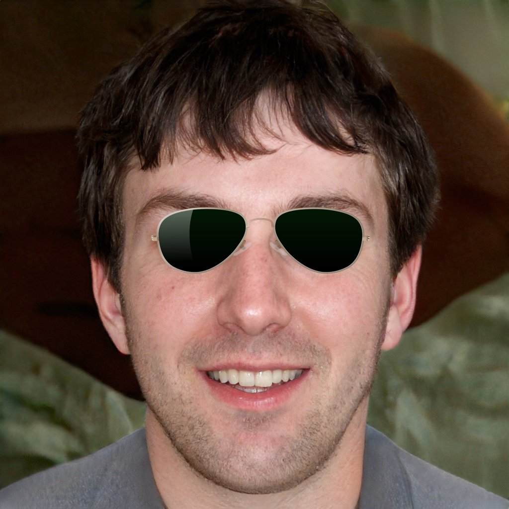

# 50_shades

Using `opencv` and a cascade classifier that detects eyes, add sun glasses to pictures of a person.

## Docker

* Build: `docker build . -t 50_shades`
* Run: `docker run -v ${PWD}/out:/out 50_shades`

## Images

* Add alpha masked sunglasses images to `sunglasses/` to add more shades
* Add pictures of a person, only images that can be ran through the classifier and find exactly 2 eyes will have shades added to them. The people sourced in this sample came from https://thispersondoesnotexist.com/

## Sample

