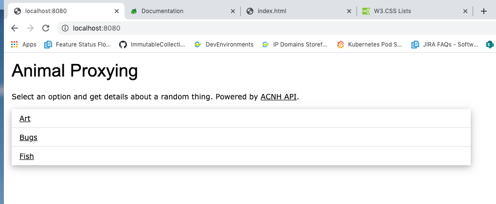
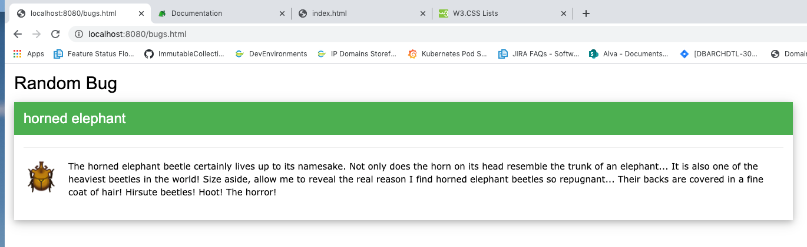

# animal_proxying

A take on [Jake Varness' animal crossing entries](https://github.com/jvarness/cerner-2-to-the-5th/tree/master/2020) using [nginx](https://nginx.org/en/) to make a small application that displays random data from the ACNH api.

## Docker

* Build: `docker build . -t animal_proxying`
* Run: `docker run -p 8080:8080 animal_proxying:latest`

Interact:

* Visit http://localhost:8080/ and select one of the options!

## Samples

