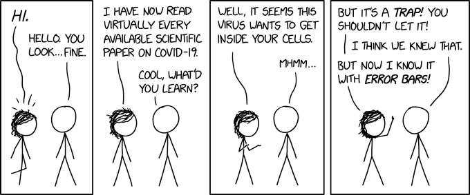
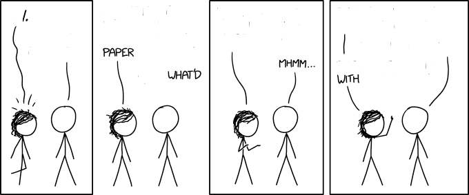
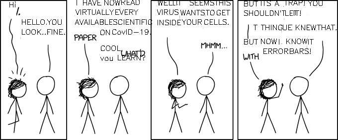

# cdxk

[xkcd](https://xkcd.com/) is a webcomic that often times features simplistic drawings and witty text. Using OCR and OpenCV, can we make templates out of the comics to fill out with our own text?

## Docker

* Build: `docker build . -t cdxk`
* Run: `docker run -v ${PWD}/output:/output -v ${PWD}/comics:/comics cdxk:latest`

## Output

The mounted folder will contain:

* `template_`: a comic with all matched text removed
* `rewrite_`: a comic with the text that was understood by the OCR program

## OCR

This sample relied on the [ocr with tesseract](https://nanonets.com/blog/ocr-with-tesseract/) tutorial.

## Sample

### Comic 

### Template 

### Rewrite 

