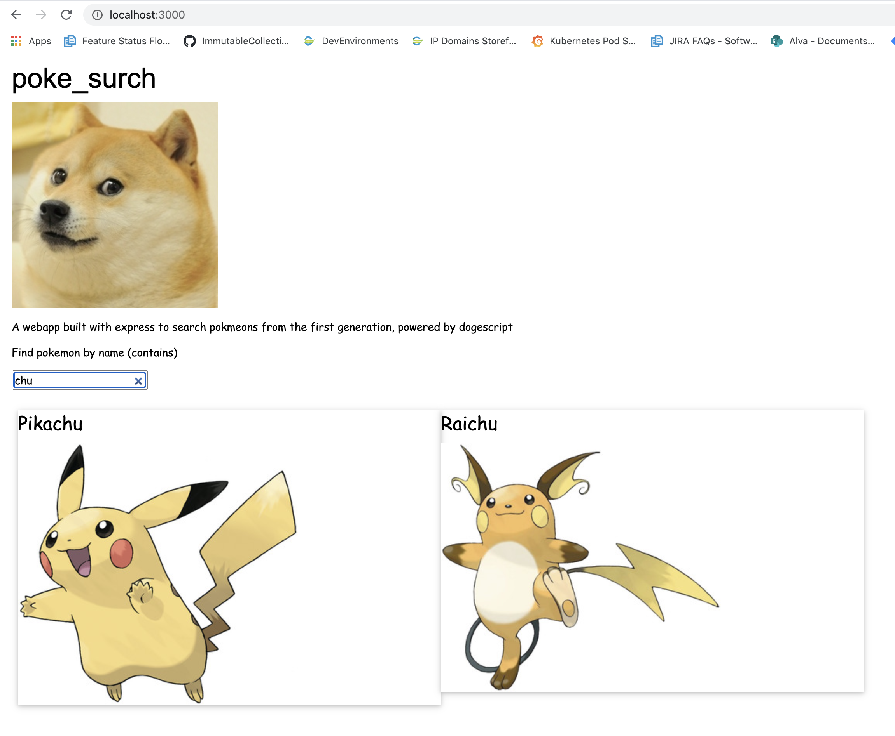

# poke_surch

An [express.js](https://expressjs.com/) webapp powered by dogescript that allows users to search for pokemon (first gen)!

## Prerequisites

 1. The `doged` image must be built

## Docker

* Build: `docker build . -t poke_surch`
* Run: `docker run --init -p 3000:3000 poke_surch`

Interact: Visit `http://localhost:3000` and play with the webapp!

## Data

* Pokedex image/name data came from: https://github.com/dmedina0217/pokedex/blob/master/pokemon-images.json

## Sample

