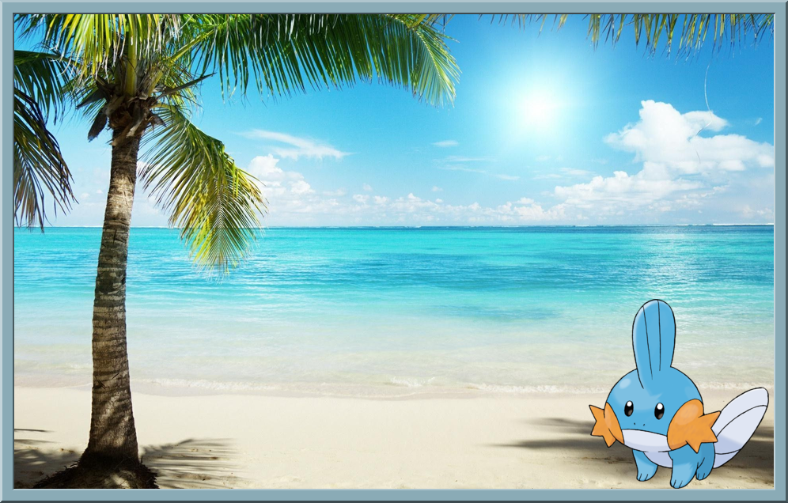

# poke_vacation

If pokemons could take vacations, where would they go?

[imagemagick](https://imagemagick.org/script/index.php) is an image manipulation tool, with it, and the power of creativity, we can give fictitious vacations to pokemon.

## Docker

Within this folder:
```
docker build . -t poke_vacation:latest
docker run poke_vacation:latest
```

### Extracting Images

Images are generated to the `out/` folder in the container, there's 2 ways to fetch them.

1. Mount a volume:

```
docker run -v ${PWD}/out:/out poke_vacation:latest
```

2. Copy them from the container
```
docker ps -a
docker cp $ID_OF_CONTAINER:out/the_image.png .
```


