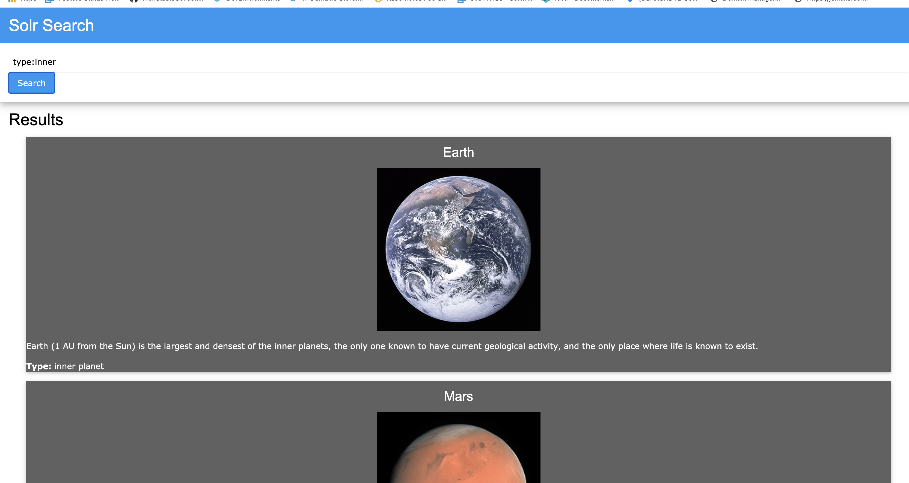

# solr_system

A [solr](https://en.wikipedia.org/wiki/Apache_Solr) powered [Solar System](https://en.wikipedia.org/wiki/Solar_System) search!

## Docker

* Build: `docker build . -t solr_system`
* Run: `docker run --name solr_system -p 8983:8983 solr_system`

Interact:

* Open the `index.html` page in your browser and use the search bar

Sample Queries:

* `*:*` - displays information about all known objects
* `name:*e*` - displays info about all objects with an e in their name
* `type:planet` - only shows planets
* `type:satellite` - only shows satellites
* `type:inner` - only planets in the inner belt

## Sample

