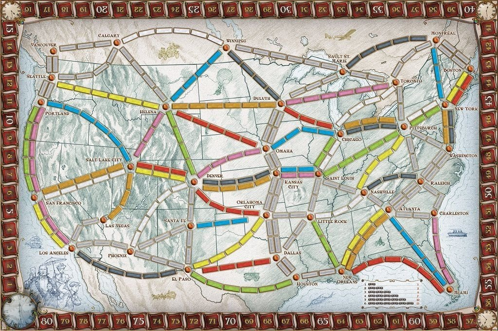

# trains

[Ticket To Ride](https://www.daysofwonder.com/tickettoride/en/usa/) is a board game where playes have to connect cities by creating railways between them. Railways are built with train cards, and missions for certain routes give more points. This game should be solvable with graph algorithms, right?

This sample creates the backing graph structure using [`neo4j`](https://neo4j.com/).




## Docker

* Build: `docker build . -t trains_db`
* Run:
```bash
docker run \
    --name trains_db \
    -p7474:7474 -p7687:7687 \
    -v $HOME/neo4j/data:/data \
    -v $HOME/neo4j/logs:/logs \
    -v $HOME/neo4j/plugins:/plugins \
    trains_db:latest
```

Interact:

```bash
docker exec -it trains_db cypher-shell -u neo4j -p test
```

In cypher-shell
```cypher
// see all nodes
match(n) return (n);

// find single route destinations
MATCH (:City { name: 'KANSAS CITY' })-[:ROUTE]->(destination)
RETURN destination.name;

// find routes from one city to another with at most x steps
MATCH (a {name:"VANCOUVER"}), (b {name: "WINNIPEG"})
MATCH p1=(a)-[:ROUTE*1..3]-(b)
return p1;

// shortest path no direction
MATCH (start {name:"KANSAS CITY"}), (end {name: "VANCOUVER"}),p = allShortestPaths((start)-[*]-(end))
RETURN p;

// shortest paths with direction
MATCH (start {name:"KANSAS CITY"}), (end {name: "WASHINGTON"}),p = allShortestPaths((start)-[*]->(end))
RETURN p;
```

## Clean

```bash
docker container rm trains_db
```