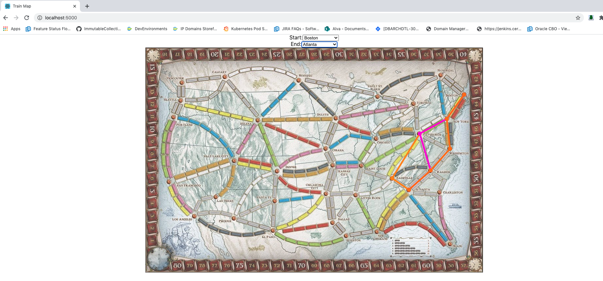

 # trains_map

The culmination on our work on `trains_db` and `trains_api`. Let's connect the dots now!

 ## Prerequisites

 1. The `trains_db` image must be built
 1. The `trains_api` image must be built

 ## Docker

 1. Run: `docker-compose up`

 ## Interact

1. Visit http://localhost:5000/
2. Use the UI to select cities and see the shortest paths between them

 ## Sample

